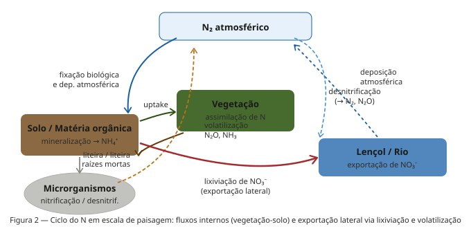
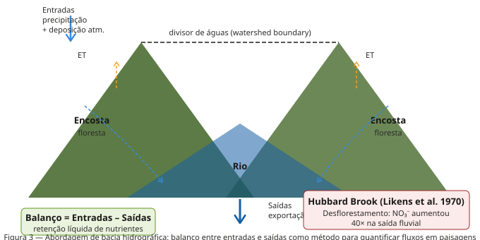

---

## Da estrutura para a função

**Onde estamos no curso:**

- **Semana 8: Função** — como energia e matéria se movem

**A pergunta central:**

- Como o **padrão espacial** do mosaico de paisagem controla os fluxos de energia e nutrientes?
- A mesma área de floresta tem impacto biogeoquímico diferente dependendo de **onde** está na paisagem


---

## Tipos de fluxo no mosaico

:::: {.columns}

::: {.column width="48%"}

**Três categorias de fluxo (Forman & Godron 1986):**

- **Energia:** 
- **Materiais:**
- **Organismos:** 

**O motor dos fluxos:** ->>> **Heterogeneidade espacial** 

:::

::: {.column width="4%"}
:::

::: {.column width="48%"}


:::

::::

---

## O ciclo do nitrogênio em paisagens

:::: {.columns}

::: {.column width="48%"}

**Por que o N é o nutriente-traçador da paisagem?**

- Altamente solúvel 
- Fixação → uptake vegetal → liteira → mineralização → nitrificação
- Lixiviação de NO₃⁻ 
- Volatilização (N₂O, NH₃) 
- Deposição atmosférica

:::

::: {.column width="4%"}
:::

::: {.column width="48%"}



:::

::::

---

## A abordagem de bacia hidrográfica

:::: {.columns}

::: {.column width="48%"}

**O experimento de Hubbard Brook:**

- **Entradas**: precipitação + deposição atmosférica
- **Saídas**: fluxo fluvial na foz
- **Balanço** = Entradas − Saídas = acúmulo ou perda de nutrientes

:::

::: {.column width="4%"}
:::

::: {.column width="48%"}



:::

::::

---

## O experimento de desmatamento

:::: {.columns}

::: {.column width="48%"}

- Desmatamento total + inibição da regeneração (1965–66)
- Aumento exportação de NO₃⁻ em **~40 vezes**
- Escoamento total aumentou **~4 vezes**
- Exportação de Ca²⁺ e K⁺ aumentou 


:::

::: {.column width="4%"}
:::

::: {.column width="48%"}


:::

::::

---

## Zonas ripárias: filtros biogeoquímicos

:::: {.columns}

::: {.column width="48%"}

**Os quatro mecanismos de remoção:**

1. **Desnitrificação** — bactérias anaeróbias convertem NO₃⁻ em N₂/N₂O em solos ripários saturados
2. **Assimilação vegetal** — plantas ripárias absorvem N e P da água subterrânea em direção ao rio
3. **Adsorção de P** — solo mineral ripário adsorve P solúvel
4. **Retenção de sedimento** — rugosidade da vegetação reduz escoamento e promove deposição

**Eficiência documentada:**

- NO₃⁻: 70–90% de remoção em faixas de 50–100 m
- P total: 60–80%
- Sedimento: >80%

:::

::: {.column width="4%"}
:::

::: {.column width="48%"}


:::

::::

---

## APP ripária: suficiente para a biogeoquímica?

:::: {.columns}

::: {.column width="48%"}

**Código Florestal Brasileiro (Lei 12.651/2012):**

- Rios &lt;10 m: APP mínima de **30 m**
- Rios 10–50 m: **50 m**
- Rios >600 m: **500 m**

**O que a biogeoquímica diz:**

- 30 m: eficiente para estabilização de margens e parte da retenção de sedimento
- Para remoção eficiente de NO₃⁻ em áreas com alta carga agrícola: **50–200 m** necessários
- Quanto maior a intensidade agrícola, maior a largura necessária

**Paradoxo das APPs mínimas:**

- Legalmente adequado ≠ biogeoquimicamente adequado
- Ponto de debate científico e político central no Brasil

:::

::: {.column width="4%"}
:::

::: {.column width="48%"}


:::

::::

---

## Padrão de paisagem e NPP

:::: {.columns}

::: {.column width="48%"}

**A NPP não é uma soma simples dos elementos:**

- A **configuração espacial** — forma, tamanho, arranjo dos patches — afeta a NPP total da paisagem
- **Efeito de borda:** bordas florestais têm NPP mais alta que interiores (mais luz, água, nutrientes) — mas também mais perda de N
- **Subsidio hídrico:** zonas ripárias e planícies de inundação têm NPP consistentemente mais alta (posição topográfica baixa = subsidio contínuo de água e nutrientes)

**Hotspots de produtividade:**

- Posições topograficamente baixas (fundos de vale, planícies aluviais)
- Bordas entre patches com recursos complementares
- Zonas de transição floresta-campo com alta disponibilidade de luz

:::

::: {.column width="4%"}
:::

::: {.column width="48%"}


:::

::::

---

## Sequestro de carbono na paisagem

:::: {.columns}

::: {.column width="48%"}

**C não depende só de quanto há de floresta — depende de onde:**

- Florestas sobre solos orgânicos profundos (várzeas, ambientes hídricos) têm estoques de C muito superiores às sobre solos minerais
- Fragmentação aumenta fluxos laterais de C orgânico para rios como CO₂ e DOC — reduzindo sequestro líquido terrestre
- Mesmo sem reduzir cobertura, fragmentação altera balanço de C via efeitos de borda e fluxos aquáticos

**Brasil e o ciclo do carbono:**

- Amazônia: sumidouro líquido de C em florestas íntegras; fonte em áreas degradadas
- Cerrado: solos com alto estoque de C em raízes e horizonte subsuperficial — frequentemente ignorado em estimativas
- Mata Atlântica: solos altamente heterogêneos — stocks de C concentrados nos patches de florestas maduras contínuas

:::

::: {.column width="4%"}
:::

::: {.column width="48%"}


:::

::::

---

## Subsidios cruzados entre ecossistemas

:::: {.columns}

::: {.column width="48%"}

**Definição:** transferência de energia e matéria de um tipo de ecossistema para outro, alterando a estrutura e função do receptor

**Terra → Água:**

- Folhas e gravetos = principal fonte de energia para invertebrados de rios de cabeceira
- Insetos terrestres caindo na água = subsídio sazonal para peixes
- N e P dissolvidos via escoamento

**Água → Terra:**

- Insetos aquáticos emergentes = subsídio para aves e aranhas ripárias
- Peixes predados por aves e mamíferos = transferência de nutrientes aquáticos para o interior florestal

**Caso clássico:** Salmões do Pacífico transportam N e P marinhos para florestas ribeirinhas da América do Norte

:::

::: {.column width="4%"}
:::

::: {.column width="48%"}


:::

::::

---

## Uso do solo e fluxos biogeoquímicos

:::: {.columns}

::: {.column width="48%"}

**Conversão floresta → agricultura altera:**

- **↑ Exportação de NO₃⁻:** sem demanda biológica perene, N lixivia para rios
- **↑ Erosão e exportação de P:** solo exposto + escoamento superficial aumentado
- **↓ Sequestro de C:** perda de biomassa + oxidação da MOS
- **Alteração hidrológica:** menos ET → mais escoamento → sazonalidade de fluxos de nutrientes alterada

**Localização importa tanto quanto extensão:**

- 23% de área agrícola na bacia do Chesapeake (EUA) = 70% da exportação total de N
- Agricultura adjacente ao rio sem zona ripária tem impacto muito maior que a mesma área no interior da bacia

:::

::: {.column width="4%"}
:::

::: {.column width="48%"}


:::

::::

---

## Medindo no R: métricas de borda e fluxo

:::: {.columns}

::: {.column width="48%"}

**Métricas relevantes para fluxos biogeoquímicos:**

```r
calculate_lsm(paisagem, what = c(
  "lsm_l_ed",    # densidade de borda total
  "lsm_l_shdi",  # diversidade (heterogeneidade)
  "lsm_c_pland", # % área por classe (composição)
  "lsm_c_ed"     # borda por classe
))
```

**Interpretação biogeoquímica:**

- `ed` alta em classe agrícola → **↑ interface agrícola-floresta → ↑ risco de exportação de N**
- `shdi` alta → paisagem heterogênea → mais fluxos laterais entre patches
- `pland` de floresta ripária → **proxy de capacidade de tamponamento**

**Limitação:** métricas estruturais são proxies — fluxos reais exigem dados de qualidade de água ou tracers isotópicos

:::

::: {.column width="4%"}
:::

::: {.column width="48%"}


:::

::::

---

## Síntese: cinco lições

:::: {.columns}

::: {.column width="48%"}

**1. Padrão espacial controla fluxos**
- Mesma área de floresta, impacto biogeoquímico diferente dependendo de *onde* está

**2. Fronteiras são zonas ativas**
- Bordas entre patches: alta desnitrificação, decomposição acelerada, gradientes biogeoquímicos intensos

**3. Ecossistemas são abertos e interdependentes**
- Rios dependem de florestas ripárias; florestas ripárias dependem do subsidio hídrico; ambos dependem da integridade da bacia

**4. Vegetação = regulador de retenção**
- Hubbard Brook: remoção da vegetação colapsa retenção de N (×40 de exportação)

**5. Qualidade da água = integrador da paisagem**
- Estado do rio reflete composição e configuração de toda a bacia a montante

:::

::: {.column width="4%"}
:::

::: {.column width="48%"}


:::

::::

---

## {background-color="#0C447C"}

::: {style="text-align: center; padding-top: 55px;"}

[**Resumo**]{style="font-size: 1.8em; color: #E6F1FB; font-weight: 700;"}

:::

::: {style="color: #B5D4F4; font-size: 1em; max-width: 700px; margin: 0 auto; line-height: 1.9;"}

→ Função da paisagem = fluxos de energia, materiais e organismos entre patches

→ Heterogeneidade espacial gera os **gradientes** que movem energia e matéria

→ N, P, C e água cruzam fronteiras de ecossistemas — fluxos laterais são tão importantes quanto ciclos internos

→ Hubbard Brook: vegetação é o principal regulador da retenção de N nas paisagens

→ Zona ripária: filtro biogeoquímico — 70–90% de remoção de NO₃⁻ em 50–100 m

→ Subsidios cruzados: ecossistemas terrestres e aquáticos são mutuamente dependentes

→ Localização do uso do solo na paisagem importa tanto quanto sua área total

:::

::: {style="margin-top: 1.5em; color: #85B7EB; font-size: 0.82em; text-align: center;"}
BO-304 Ecologia de Paisagens · Prof. Felipe Melo · UFPE 2026.1
:::
